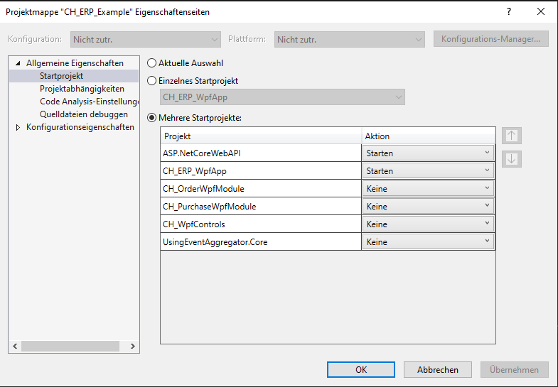

Willkommen zu meinem Projekt CH_ERP_Example!
==================

CH_ERP_Example ist ein Beispiel, welches aus folgenden Teilen besteht.

* WPF Clientmit MVVM Prism, welches aus folgenden Modulen besteht
    * Einkauf
    * Bestellungen
* APP.NET Core RestAPI, was auf dem Server laufen würde.

Eventuell kommt später auch

* WCF Service (Nur mit dem WPF Client)
* Angular Client der mit dem ASP.NET Core RestAPI sich seine Informationen holt.

Hier wie es zur Zeit noch aussieht:

    </a>

  
Ich will damit auch mal zeigen, das die Softwareentwicklung gar nicht so schwer sein muss. Denn dieses Projekt kann wachsen, da es sehr wartbar ist. :-)

Bitte Bescheid geben, wenn es Probleme mit der kompilierung geben sollte oder der Datenbankeinbindung. Die Reihenfolge ist auch wichtig in der Projekt Mappe.  

    </a>

