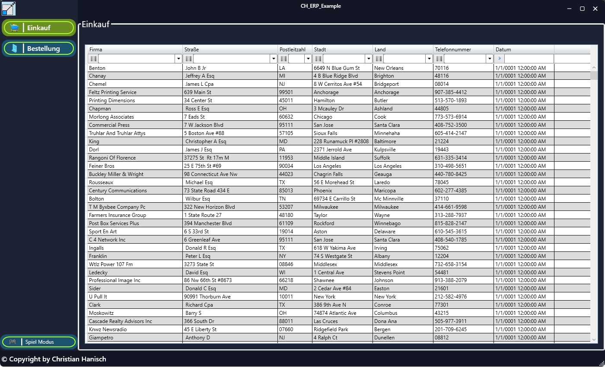

Willkommen zu meinem Projekt CH_ERP_Example!
==================

[![GitHub Actions status][GitHub Actions SVG]][GitHub Actions]

CH_ERP_Example ist ein Beispiel welches aus folgenden Teilen besteht.

* WPF Clientmit MVVM Prism, welches aus folgenden Modulen besteht
    * Einkauf
    * Bestellungen
* APP.NET Core RestAPI, was auf dem Server laufen würde.

Später sind folgende 
* WPF Client
* APP.NET Core RestAPI

Hier wie es zur Zeit noch aussieht:

    </a>

  
Ich will damit auch mal zeigen, das die Softwareentwicklung gar nicht so schwer sein muss. Den diesen Projekt kann wachsen, da es sehr wartbar ist. :-)

